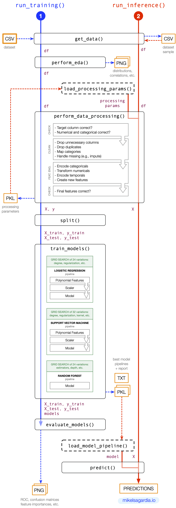

# Predict Customer Churn Using Production-Level Code

This repository contains a project that analyzes and predicts **Customer Churn** using the [Credit Card Customers](https://www.kaggle.com/datasets/sakshigoyal7/credit-card-customers/code) dataset from [Kaggle](https://www.kaggle.com/). 

Data analysis, modeling and inference pipelines are implemented in the project to end up with an interpretable model that is also able to predict customer churn. However, the focus of the project are neither the business case nor the analysis and modeling techniques; instead, **the goal is to provide with a boilerplate that shows how to transform a research notebook into a development/production environment code using as few additional tools as possible**. Concretely, the research notebook [churn_notebook.ipynb](churn_notebook.ipynb) is transformed into a python package contained in [customer_churn](customer_churn).

Note that not all aspects necessary in a ML worklflow are covered:

- The Exploratory Data Analysis (EDA) and Feature Engineering (FE) done during the data processing are very simple.
- The generated artifacts are not tracked or versioned (e.g., model-pipelines, processed data, etc.)
- No thorough deployment nor API are created, although [docker](https://www.docker.com) containerization is introduced.
- etc.

If you are interested in some of the aforementioned topics, you can visit other of my boilerplate projects listed in the section [Interesting Links](#interesting-links). However, let me reiterate the leitmotiv of this repository: **production-level data science code with as few tools as possible** :smile:

The starter code comes from a [Udacity Machine Learning DevOps Engineer Nanodegree](https://www.udacity.com/course/machine-learning-dev-ops-engineer-nanodegree--nd0821) project, although the initial status was substantially changed.

Overview of contents:

- [Predict Customer Churn Using Production-Level Code](#predict-customer-churn-using-production-level-code)
  - [Project Description](#project-description)
  - [Files and Workflow Description](#files-and-workflow-description)
  - [How to Use This](#how-to-use-this)
    - [Running the Package](#running-the-package)
    - [Testing the Package](#testing-the-package)
    - [Good Ol' `make`](#good-ol-make)
    - [Docker Image](#docker-image)
  - [Limitations of This Boilerplate](#limitations-of-this-boilerplate)
  - [Possible Improvements](#possible-improvements)
  - [Interesting Links](#interesting-links)
  - [Authorship](#authorship)


## Project Description

In the project, credit card customers that are most likely to churn are identified.  
A first version of the data analysis and modeling is provided in the notebook [churn_notebook.ipynb](churn_notebook.ipynb). As mentioned, **the main goal of the project is to transform that notebook content into a production ready package, applying clean code principles or tools**:

- Readable, simple, concise code
- PEP8 conventions, checked with `pylint` and `autopep8`
- Refactoring: Modular and efficient code
- Documentation at different stages: code, `README` files, etc.
- Error handling
- Testing with `pytest`
- Logging

The used [Credit Card Customers dataset from Kaggle](https://www.kaggle.com/datasets/sakshigoyal7/credit-card-customers/code) has the following properties:

- Original dataset size: 22 columns, 10127 data points.
- It consists of categorical and numerical features of clients which churn (cease to be clients) or not; that churn status is the binary classification target used for training, encoded as the feature `Attrition_Flag`.
- Number of features after data processing is carried out: 19.
- Modeling used on the data: logistic regression and random forests with grid search.

More details on the dataset can be found in [`data/README.md`](data/README.md).

## Files and Workflow Description

The repository contains the following files and folders:

```
.
├── Dockerfile                          # Docker image definition
├── Instructions.md                     # Original instructions from Udacity (irrelevant here)
├── Makefile                            # Simple Makefile for common chores: clean, etc.
├── README.md                           # This file
├── churn_notebook.ipynb                # Research notebook
├── config.yaml                         # Configuration file for production code
├── customer_churn                      # Production library folder, package
│   ├── __init__.py         
│   ├── churn_library.py                # Production library
│   └── transformations.py              # Utilities for library
├── data
│   ├── README.md                       # Explanation of dataset columns
│   └── bank_data.csv                   # Dataset
├── main.py                             # Executable of production code
├── pics
│   ├── pipeline_diagram.png            # Pipeline diagram
│   └── sequencediagram_org.jpeg        # Original/old sequence diagram from Udacity (irrelevant here)
├── requirements.txt                    # Dependencies
├── setup.py
└── tests                               # Pytest testing scripts
    ├── __init__.py
    ├── conftest.py                     # Pytest fixtures
    └── test_churn_library.py           # Tests of the module churn_library.py
```

All the research work of the project is contained in the notebook [`churn_notebook.ipynb`](churn_notebook.ipynb); in particular simplified implementations of the typical data processing and modeling tasks are performed:

- Dataset loading 
- Exploratory Data Analysis (EDA) and Data Cleaning
- Feature Engineering (FE)
- Training: Random Forest and Logistic Regression models are fit and the models are persisted as pickles.
- Generation of classification report plots.

The code from [`churn_notebook.ipynb`](churn_notebook.ipynb) has been transformed to create the package [`customer_churn`](customer_churn), which contains two files:

- [`churn_library.py`](customer_churn/churn_library.py): this file contains most of the refactored and modified code from the notebook.
- [`transformations.py`](customer_churn/transformations.py): definition of auxiliary transformations used in the data processing.

Additionally, a [`tests`](tests) folder is provided, which contains [`test_churn_library.py`](tests/test_churn_library.py). This script performs unit tests on the different functions of [`churn_library.py`](customer_churn/churn_library.py) using [pytest](https://docs.pytest.org/).

The executable or `main` function is provided in [`main.py`](main.py); this script imports the package [`customer_churn`](customer_churn) and runs three functions from [`churn_library.py`](customer_churn/churn_library.py):

0. `run_setup()`: the configuration file [`config.yaml`](config.yaml) is loaded and auxiliary folders are created, if not there yet:
   - `images`: it will contain the images of the EDA and the model evaluation.
   - `models`: it will contain the inference models/pipelines as serialized pickles.
   - `artifacts`: it will contain the data processing parameters created during the training and required for the inference, serialized as pickles.
1. `run_training()`: it performs the EDA, the data processing and the data modeling, and it generates the inference artifacts (the model/pipeline).
2. `run_inference()`: it shows how the inference artifacts need to be used to perform a prediction; an exemplary dataset sample created during the training is used.

The following diagram shows the workflow



A central property of the package is that `run_training()` and `run_inference()` share the function `perform_data_processing()`. When `perform_data_processing()` is executed in `run_training()`, it generates the processing parameters and stores them to disk. In contrast, when `perform_data_processing()` is executed in `run_inference()`, it loads those stored parameters to perform the data processing for the inference.

Note that `run_inference()` is not very useful in its current state, because of the following limitations:

- It reads a sample dataset from a `CSV` file, instead of waiting for requests.
- It loads the data processing parameters and the model pipeline every time new data needs to be scored, instead of keeping them model in memory.

Those limitations are to be fixed when deploying the model, which is not in the scope of this repository; in other words, I decided to leave those loose ends in order to adapt the boilerplate to particular deployment tools. However, containerization with [docker](https://www.docker.com) is briefly shown in [Docker Image](#docker-image).

## How to Use This
### Running the Package

First, create an environment (e.g., with [conda](https://docs.conda.io/en/latest/)) and install the dependencies:

```bash
cd /path/to/repository/folder
# Create the environment
conda create -n my-env python=3.8
conda activate my-env
conda install pip
# Check that the pip we use points to our environment
which pip
# Install dependencies
pip install -r requirements.txt
```

Then, we execute the main file:

```bash
python main.py
```

... and all the magic happens, as explained in the previous section.

Note that the EDA and the model evaluation are optional and can be controlled with the argument `--produce_images` in `main.py`; by default, they are active, if we'd like to switch them off, we need to run:

```bash
python main.py --produce_images 0
```

Switching off EDA and evaluation is important for the Docker container: saving matplotlib figures in a container requires a more sophisticated setup than the one explained in [Docker Image](#Docker-Image).

Optionally, you can install the package on your environment:

```bash
cd /path/to/repository/folder
conda activate my-env
# The first installation
pip install .
# If we change things in the package
pip install --upgrade .
```

If the package is installed, we can work anywhere if we have the dataset and the configuration file:

```bash
cd /path/to/new/folder
cp -r /path/to/repository/folder/data .
cp /path/to/repository/folder/main.py .
cp /path/to/repository/folder/config.yaml .
python main.py
```

### Testing the Package

To test the functions from [`churn_library.py`](customer_churn/churn_library.py) using `pytest`:

```bash
cd /path/to/repository/folder
python tests/test_churn_library.py
```

This command not only tests the package, but it also fully runs the training and inference pipelines, generating models and other artifacts.

Note that, since the `logging` module is used, it is not enough running barely `pytest` in the Terminal, we need to run the command above to test the package.

If you would like to check the PEP8 conformity of the files:

```bash
pylint customer_churn/churn_library.py # should yield 8.07/10
pylint tests/test_churn_library.py # should yield 8.49/10
```

Tip: If you'd like to automatically edit and improve the score of a file that already has a good score, you can try `autopep8`:

```bash
autopep8 --in-place --aggressive --aggressive customer_churn/churn_library.py
```
### Good Ol' `make`

Because the C-Universe had already most of the required tools.

```bash
# If you like to delete the models, artifacts, folders, etc.
# created when the training pipelines are run
make clean
```

### Docker Image

The [Dockerfile](Dockerfile) defines a simple image based on Python 3.8 which can be built and executed as a container:

```bash
# Build image
docker image build -t customer_churn_app .
# Run with shell access and remove container when finished
docker container run -it --rm --name customer_churn_app customer_churn_app
```

As explained in [Running the Package](#running-the-package), the EDA and the model evaluation are switched off for the docker image, because saving matplotlib images requires a more sophisticated setup than the one provided.

## Limitations of This Boilerplate

- No tracking of datasets / models / experiments / artifacts is done. Doing that is **fundamental** if we want to scale, and it implies using additional tools, such as [Weights and Biases](https://wandb.ai).
- Maybe all the steps could be re-written in an Object Oriented style and packed in to a [Scikit-Learn](https://scikit-learn.org/stable/) `Pipeline`. However, I think that increases the complexity; I prefer to use a mixed approach in which transformations are defined in classes, while they are applied in a function. Additionally, that makes the boilerplate easier to adapt to concrete applications and frameworks other than [Scikit-Learn](https://scikit-learn.org/stable/).
- No serving via an API is discussed.

If you are interested in any of those topics, please visit the section [Interesting Links](#interesting-links).

## Possible Improvements

- [x] Add dependencies and libraries to `README.md`.
- [x] Re-factor data processing functions to work as transformer classes.
- [x] Create two separate simplified pipelines: training and inference.
- [x] Re-factor data processing function to be able to run it during training or inference.
- [x] Add logging to pipeline executions, too, not only to the testing module.
- [x] Create a `conftest.py` file for testing.
- [x] Move function parameters to a YAML configuration file.
- [x] Create a python package.
- [x] Update `README.md` with new contents: new files, new execution commands, etc.
- [x] Draw new sequence diagram.
- [x] Create a docker image.
- [ ] **Further parametrize all hard-coded variables from `conftest.py` and include them in `config.yaml`; a `config` object should be passed to the functions in `churn_library.py` to avoid hard-coding.**
- [ ] Explain the columns from the dataset in [`data/README.md`](data/README.md).
- [ ] Further re-factor functions; e.g., some EDA plot generations contain repeated computations that can be parametrized.
- [ ] Work towards `pylint` score of 10/10. However, note that some variable names were chosen to be non-PEP8-conform due to their popular use in the field (e.g., `X_train`).

## Interesting Links

- Guide on EDA, Data Cleaning and Feature Engineering: [eda_fe_summary](https://github.com/mxagar/eda_fe_summary).
- A boilerplate for reproducible (tracked) ML pipelines with MLflow and Weights & Biases which uses a music genre classification dataset from Spotify: [music_genre_classification](https://github.com/mxagar/music_genre_classification).
- My notes on the [Udacity Machine Learning DevOps Engineering Nanodegree](https://www.udacity.com/course/machine-learning-dev-ops-engineer-nanodegree--nd0821), which features more MLOps content: [mlops_udacity](https://github.com/mxagar/mlops_udacity).
## Authorship

Mikel Sagardia, 2022.  
No guarantees.

The original content of this project was taken from the [Udacity Machine Learning DevOps Engineer Nanodegree](https://www.udacity.com/course/machine-learning-dev-ops-engineer-nanodegree--nd0821), but it has been modified and extended to the present state.